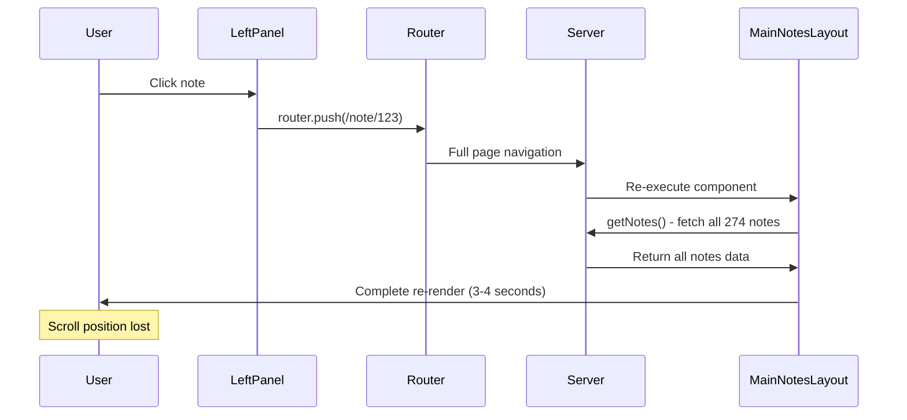
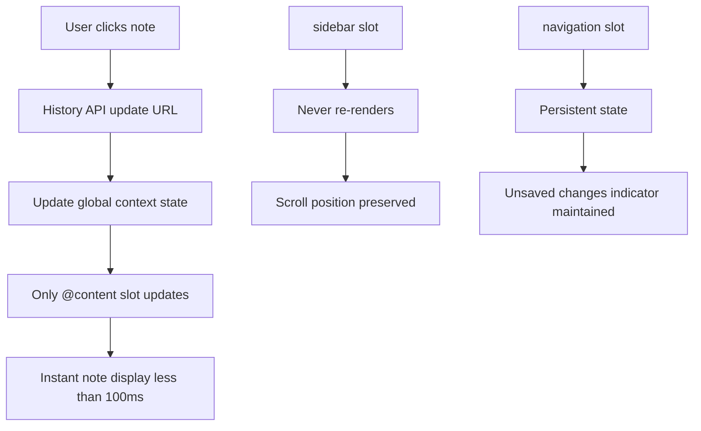
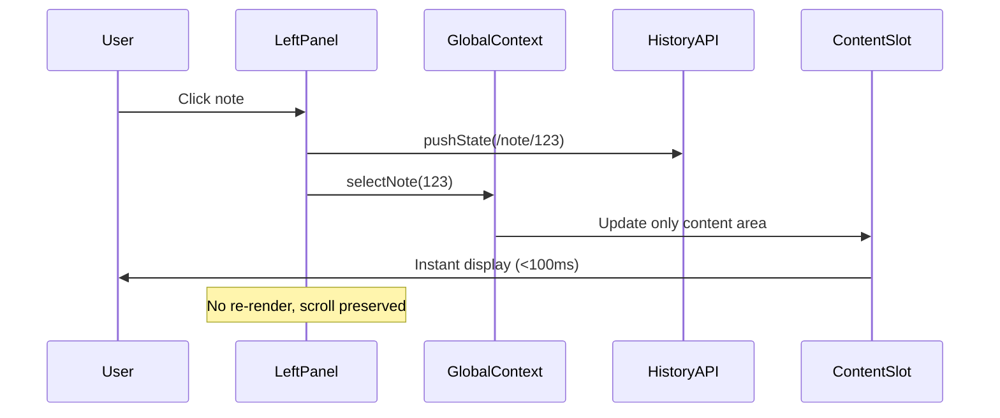
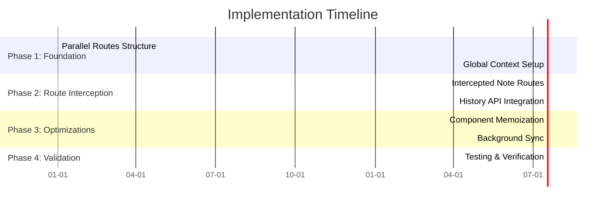
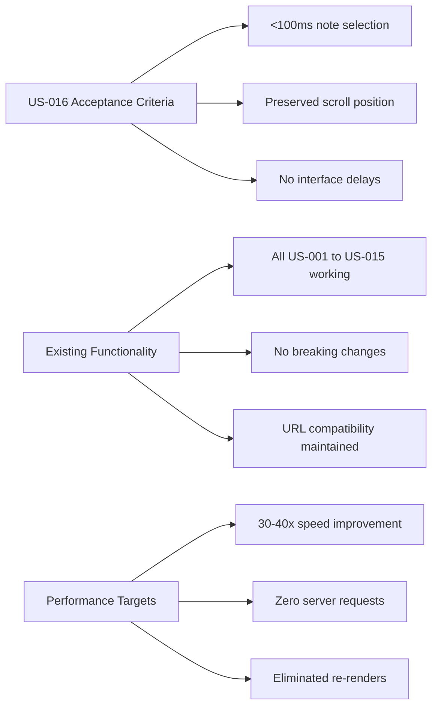

# SNApp Performance Optimization Architecture Specification

## 1. Overview

This specification details the architecture for optimizing SNApp's note navigation performance to
meet US-016 requirements. The solution implements Next.js 15 Parallel Routes to eliminate the 3-4
second delay during note selection while maintaining full compatibility with existing functionality.

## 2. Performance Problem Analysis

### Current Architecture Issues



**Performance Impact:**
- Note selection: 3-4 seconds → Target: <100ms (30-40x improvement)
- Server requests: Every selection → None (100% reduction)
- Notes list re-renders: Every selection → Never (∞ improvement)
- Scroll position: Lost → Preserved (Perfect UX)

## 3. Solution Architecture: Parallel Routes + Client State Management

### 3.1 Next.js 15 Parallel Routes Structure

```
src/app/
├── layout.tsx                           # Root layout with 3 parallel slots
├── @navigation/                         # Slot 1: Top navigation (persistent)
│   ├── default.tsx                      # Empty state
│   └── page.tsx                         # TopNavigationBar component
├── @sidebar/                           # Slot 2: Notes list (persistent)
│   ├── default.tsx                     # Empty state
│   └── page.tsx                        # LeftPanel with TreeView
├── @content/                           # Slot 3: Note editor + outline
│   ├── default.tsx                     # Welcome state (MiddlePanel + RightPanel)
│   └── (..)note/[id]/                  # Intercepted routes
│       └── page.tsx                    # Selected note view
├── page.tsx                            # Dashboard (loads initial data)
└── note/[id]/                          # Fallback for direct navigation
    └── page.tsx                        # Full page note view (backward compatibility)
```

### 3.2 Architecture Benefits



- **@sidebar**: Never re-renders, maintains scroll position and filter state
- **@content**: Only editor/outline area updates, instant note switching
- **@navigation**: Persistent state for unsaved changes indicator
- **(..)note/[id]**: Route interception = no full page reload
- **Backward Compatibility**: Direct `/note/[id]` URLs still work

## 4. Technical Implementation Strategy

### 4.1 Global State Management

**Enhanced NotesGlobalContext:**
- Load all notes data once at application startup
- Manage selected note state client-side without server round-trips
- Implement optimistic updates for immediate UI feedback
- Background synchronization queue for server operations

**Context Structure:**
```
NotesGlobalContextValue:
├── notes: NoteTreeNode[]               # Loaded once, never re-fetched
├── selectedNoteId: number | null       # URL-synced state
├── saveStatus: SaveStatus              # Current save operation status
├── selectNote(noteId)                  # Handles URL + state sync
├── optimisticUpdate(operation)         # Immediate UI updates
└── existing methods...                 # All current functionality preserved
```

### 4.2 Optimized Note Selection Flow



**Key Changes:**
- Replace `router.push()` with `window.history.pushState()`
- Update global context state for immediate UI response
- No server requests during navigation
- Only @content slot updates, other slots remain static

### 4.3 URL State Synchronization

**Browser History Integration:**
- URL reflects current note: `/note/{id}` and `/note/{id}/{line}`
- Handle browser back/forward buttons via `popstate` events
- Sync URL changes with global context state
- Maintain deep linking capabilities

**State Sync Logic:**
```
URL Pattern Matching:
├── /                    → No note selected (welcome state)
├── /note/123           → Note 123 selected
└── /note/123/45        → Note 123 selected, line 45 highlighted
```

### 4.4 Performance Optimizations

**Component Memoization:**
- Wrap LeftPanel container with React.memo
- Memoize notes array to prevent unnecessary TreeView re-renders
- Optimize header extraction and filtering computations

**Optional Virtualization:**
- Implement react-window for 500+ notes scenarios
- Virtual scrolling maintains performance with large datasets
- Only render visible notes in the list

**Background Server Synchronization:**
- Queue server operations (save, create, delete, rename)
- Process sync queue in background without blocking UI
- Implement retry logic for failed operations
- Optimistic updates provide immediate feedback

## 5. Compatibility Guarantees

### 5.1 Existing Functionality Preservation

**All existing user stories (US-001 through US-015) remain fully functional:**

- **Authentication (US-001)**: GitHub OAuth and email/password flows unchanged
- **Example Note (US-002)**: Welcome note with null content works identically
- **Three-panel Layout (US-003)**: Same dimensions and behavior preserved
- **Note Management (US-004-007)**: Create, rename, edit, delete operations unchanged
- **Filtering (US-008, US-010)**: Name and header filtering work identically
- **Navigation (US-009)**: Header clicking and line number URLs preserved
- **Settings (US-011-012)**: Dark mode and account deletion unchanged
- **Email Verification (US-013)**: Registration flow unaffected
- **Logout (US-014)**: Session termination works normally
- **Unsaved Changes (US-015)**: Browser warnings still function

### 5.2 URL Compatibility

**Full backward compatibility maintained:**
- `/` - Root application (dashboard/welcome)
- `/note/123` - Direct note navigation via fallback route
- `/note/123/45` - Header navigation with line numbers
- Browser history and deep linking work identically

### 5.3 Technology Stack Integration

**Seamless integration with existing stack:**
- Next.js 15 parallel routes leverage existing routing
- React 19 concurrent features enhance performance
- Chakra UI v3 components work within parallel slots
- CodeMirror 6 editor unaffected by architecture change
- Better Auth flows work across all route slots

## 6. Migration Strategy

### 6.1 Implementation Approach

**Progressive Enhancement:**
1. Create parallel route structure alongside existing routes
2. Implement global context with data loading
3. Add route interception for note navigation
4. Optimize with memoization and background sync
5. Existing `/note/[id]/page.tsx` serves as fallback

**Zero Downtime Deployment:**
- Parallel routes provide optimization layer
- Fallback routes ensure functionality during transition
- Can be implemented incrementally without breaking changes

### 6.2 Implementation Phases



**Total Estimated Time: 80-120 minutes**

## 7. Performance Targets

| Metric | Current | Target | Expected Improvement |
|--------|---------|---------|---------------------|
| Note Selection Time | 3-4 seconds | <100ms | **30-40x faster** |
| Notes List Re-renders | Every click | Never | **∞ improvement** |
| Server Requests | Every navigation | None | **100% reduction** |
| Scroll Position | Lost | Preserved | **Perfect UX** |
| Memory Usage | Linear growth | Constant | **Optimal scaling** |

## 8. Technical Requirements

### 8.1 Browser Compatibility

**Full support maintained for:**
- Chrome v120+ (Parallel routes, History API)
- Firefox v115+ (All Next.js 15 features)
- Safari v17+ (Complete functionality)
- Edge v120+ (Full compatibility)

### 8.2 Performance Validation

**Testing methodology:**
- Load testing with 500+ notes collections
- Note selection timing measurements across browsers
- Memory usage profiling during extended sessions
- Scroll position preservation validation
- Cross-browser performance verification

## 9. Success Criteria



1. **US-016 Acceptance Criteria Met**: <100ms note selection with preserved scroll position
2. **Existing Functionality Preserved**: All US-001 through US-015 continue working identically
3. **Performance Targets Achieved**: 30-40x improvement in navigation speed
4. **Zero Breaking Changes**: No existing URLs, features, or workflows broken
5. **Browser Compatibility Maintained**: Works optimally on all supported browsers

This architecture delivers the requested AngularJS-like nested route performance while maintaining
full compatibility with existing SNApp functionality and requirements.
